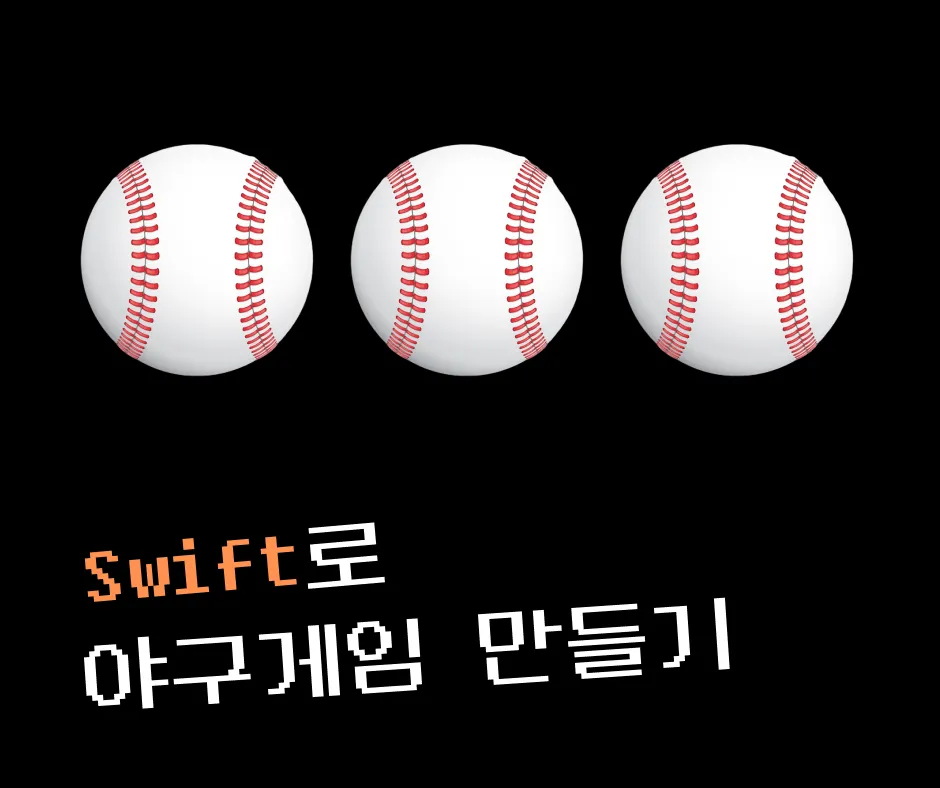

# Baseball Game

1. Lv1 `03/17 까지`
    -  1 에서 9까지의 서로 다른 임의의 수 3개를 정하고 맞추는 게임입니다
    -   정답은 랜덤으로 만듭니다.(1에서 9까지의 서로 다른 임의의 수 3자리)
     
2. Lv2 `03/17 까지`
    -   정답을 맞추기 위해 3자리수를 입력하고 힌트를 받습니다
        -   힌트는 야구용어인 **볼**과 **스트라이크**입니다.
        -   같은 자리에 같은 숫자가 있는 경우 **스트라이크**, 다른 자리에 숫자가 있는 경우 **볼**입니다
        - ex) 정답 : 456 인 경우
            - 435를 입력한 경우 → 1스트라이크 1볼
            - 357를 입력한 경우 → 1스트라이크
            - 678를 입력한 경우 → 1볼
            - 123를 입력한 경우 → Nothing
        - 만약 올바르지 않은 입력값에 대해서는 오류 문구를 보여주세요
    - 3자리 숫자가 정답과 같은 경우 게임이 종료됩니다

    ## 4️⃣ 도전 구현기능 가이드

1. Lv3 `03/18 까지`
    - [ ]  정답이 되는 숫자를 0에서 9까지의 서로 다른 3자리의 숫자로 바꿔주세요
        - 맨 앞자리에 0이 오는 것은 불가능합니다
            - 092 → 불가능
            - 870 → 가능
            - 300 → 불가능

- LV3 까지 구현 완료